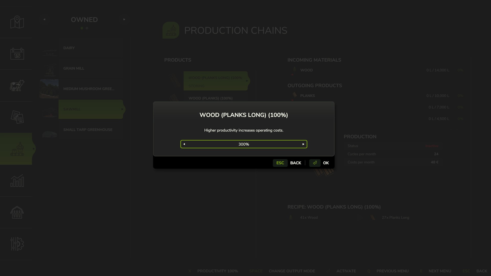

# FS25 Production Control

A script mod for **Farming Simulator 25** that enhances control over production chains. 
Now your factories can operate in three 8-hour shifts.

## 📦 Features

- Set speed for each product line (50%-300%)
- Costs scale proportionally with production speed
- In multiplayer, production controls are available to the farm manager
- Compatible with singleplayer and multiplayer

## 📁 Download and Installation

1. Download the latest release from the [ModHub](https://www.farming-simulator.com/mod.php?mod_id=319198&title=fs2025), [Releases](https://github.com/Temmmych/FS25_ProductionControl/releases) page or [direct link](https://github.com/Temmmych/FS25_ProductionControl/releases/download/v1.0.0.1/FS25_ProductionControl.zip).
2. Place the `.zip` file into your mod folder (Example: `Documents/My Games/FarmingSimulator2025/mods`).
3. Enable the mod in the game.

## 🖼️ Screenshots
  
  
  
 

## 🤝 Special Thanks

- Thanks to the [Katiuzh community](https://www.youtube.com/@katiuzh) for their support during the development of the mod
